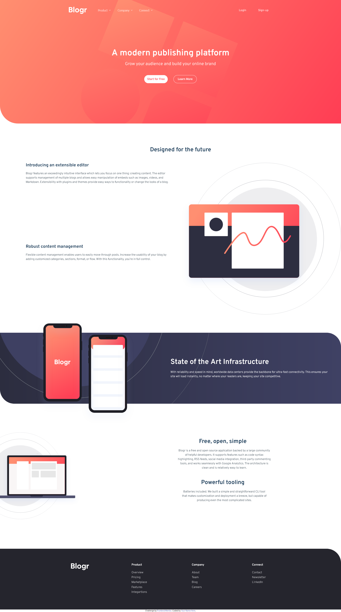

# Frontend Mentor - Blogr landing page solution

This is a solution to the [Blogr landing page challenge on Frontend Mentor](https://www.frontendmentor.io/challenges/blogr-landing-page-EX2RLAApP). Frontend Mentor challenges help you improve your coding skills by building realistic projects.

## Table of contents

- [Overview](#overview)
  - [The challenge](#the-challenge)
  - [Screenshot](#screenshot)
  - [Links](#links)
- [My process](#my-process)
  - [Built with](#built-with)
  - [What I learned](#what-i-learned)
- [Author](#author)

## Overview

### The challenge

Users should be able to:

- View the optimal layout for the site depending on their device's screen size
- See hover states for all interactive elements on the page

### Screenshot

### Links

- Solution URL: [Frontendmentor]()
- Live Site URL: [Netlify](https://blogrnova.netlify.app/)

## My process

### Built with

- HTML 5
- Sass
- Grid
- Flexbox
- Javascript

### What I learned

I have learned how to create a basic dropdown menu.

## Author

- Frontend Mentor - [@Nova988](https://www.frontendmentor.io/profile/Nova988)
- Github - [@Nova988](https://github.com/Nova988)
- Twitter - [@A_Nova988](https://twitter.com/A_Nova988)
